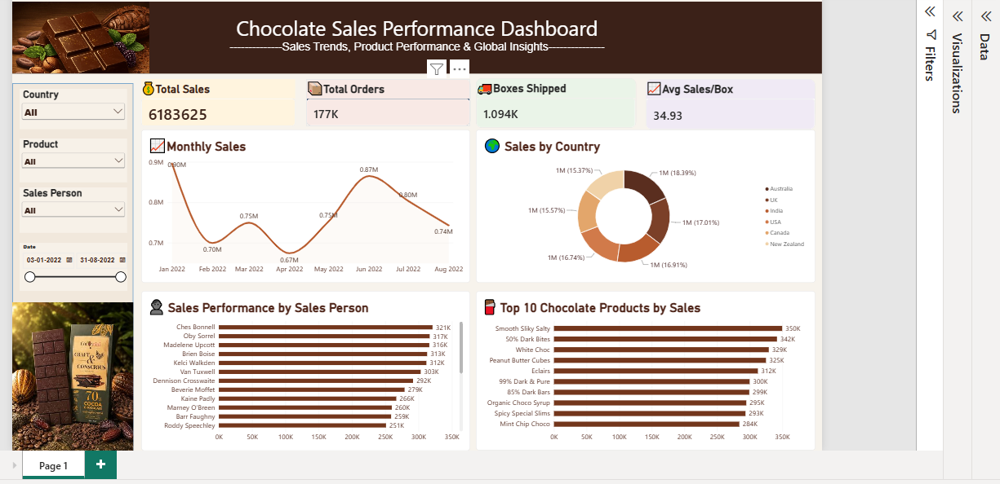

# 🍫 Chocolate Sales Performance Dashboard

## 📊 Project Overview

This project presents an interactive Power BI dashboard developed to analyze chocolate sales performance and provide meaningful business insights.

The dashboard analyzes sales trends across different months, countries, salespersons, and chocolate products.

## 🎯 Project Objective

The objective of this project is to transform chocolate sales data into an interactive and easy-to-understand dashboard that helps analyze sales performance and identify important trends.

## 🛠️ Tools & Technologies

- Power BI
- Microsoft Excel
- DAX
- Data Visualization
- Data Analysis

## 📈 Dashboard Features

- Total Sales analysis
- Total Orders analysis
- Boxes Shipped analysis
- Average Sales per Ticket
- Monthly Sales Trends
- Sales by Country
- Salesperson Performance
- Top 10 Chocolate Products
- Interactive filtering and visualization

## 🖼️ Dashboard Preview

## 🎥 Dashboard Demonstration

A demonstration video of the interactive Power BI dashboard is available below:

[Watch Dashboard Demo](Chocolate-Sales-Dashboard-Demo.mp4)

## 💡 Key Skills Demonstrated

- Data Cleaning
- Data Analysis
- Data Visualization
- Power BI Dashboard Development
- DAX
- Business Intelligence
- Interactive Reporting

## 📁 Project Files

| File | Description |
|------|-------------|
| `Chocolate-Sales-Dashboard.PNG` | Power BI dashboard screenshot |
| `Chocolate-Sales-Dashboard-Demo.mp4` | Dashboard demonstration video |
| `README.md` | Project documentation |

## 👩‍💻 Author

**Shreya Singu**

Aspiring Data Analyst | Power BI | SQL | Excel
